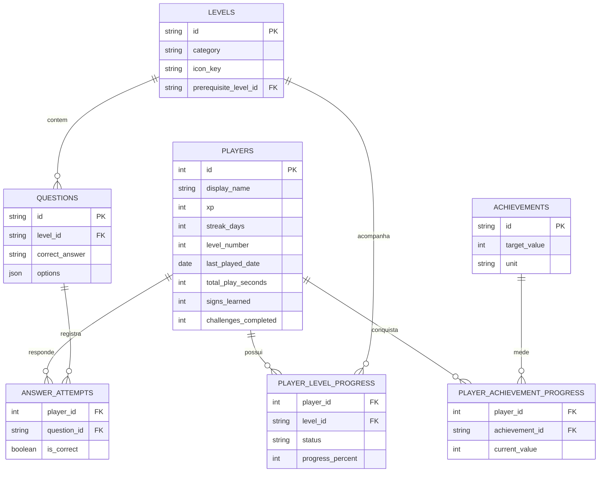

# LBRLibras

Protótipo full stack gamificado para o ensino introdutório de Libras, desenvolvido como Trabalho de Conclusão do Curso de Sistemas para Internet do IFRO.

## Arquitetura

- `backend/`: API Python com FastAPI, SQLAlchemy e SQLite, responsável pelo catálogo, respostas e progresso persistente.
- `frontend/`: aplicação React, TypeScript, Vite, Tailwind CSS e Framer Motion, com interface mobile-first.

## Executar o backend

```bash
cd backend
python -m venv .venv
.venv/Scripts/activate
python -m pip install -e ".[dev]"
uvicorn app.main:app --reload
```

A API ficará disponível em `http://127.0.0.1:8001`. A documentação interativa estará em `http://127.0.0.1:8001/docs`.

## Executar o frontend

```bash
cd frontend
pnpm install
pnpm dev
```

O frontend ficará disponível em `http://localhost:5173`.

## Blocos do protótipo

1. ✅ Fundação full stack e design system.
2. ✅ Menu principal, XP e desbloqueio local.
3. ✅ Área de jogo, feedback imediato, conclusão idempotente e +250 XP.
4. ✅ SQLite, histórico de respostas e servidor de mídias reais.
5. ✅ Menu autoral por categorias, perfil, estatísticas e conquistas persistentes.
6. ✅ Gamificação avançada com combo, XP por acerto, níveis progressivos e ofensiva diária.

## Progresso do protótipo

O menu consulta `GET /api/game/levels`, agrupa os tópicos em Princípios básicos, Alfabeto e Números e aplica os pré-requisitos informados pela API. O perfil e suas conquistas são carregados por `GET /api/game/profile`. O Nível 1 carrega as questões por `GET /api/game/levels/{level_id}/questions`, valida cada escolha por `POST /api/game/levels/{level_id}/questions/{question_id}/answer` e registra a conclusão por `POST /api/game/levels/{level_id}/complete`.

O SQLite é a fonte principal de progresso e o `LocalStorage` funciona como cópia local de apoio. A conclusão é idempotente: repetir uma aula não concede XP duplicado. O histórico pode ser consultado em `GET /api/game/progress/answers`.

Cada primeiro acerto em uma questão concede 25 XP. Os níveis usam limites cumulativos crescentes: o nível 2 começa em 100 XP, o nível 3 em 250 XP e os custos seguintes aumentam em 50 XP. A coluna `last_played_date` permite incrementar a ofensiva apenas uma vez por dia, manter a sequência em dias consecutivos e reiniciá-la após uma lacuna.

Durante cada aula, o frontend mantém o combo atual e o maior combo de respostas corretas consecutivas. O feedback animado destaca a sequência durante o quiz e a tela de conclusão registra o resumo “Maior combo da aula”, junto do XP, ofensiva diária e eventual evolução de nível.

## Esquema SQLite

| Tabela | Responsabilidade |
| --- | --- |
| `players` | Perfil, XP, sequência, tempo jogado e estatísticas de aprendizagem. |
| `levels` | Catálogo, categoria, ícone, ordem, recompensa e pré-requisito dos tópicos. |
| `questions` | Pergunta, opções, gabarito e frase enviada ao avatar. |
| `player_level_progress` | Estado bloqueado, disponível ou concluído por usuário. |
| `answer_attempts` | Alternativa escolhida, acerto/erro e data de cada resposta. |
| `achievements` | Catálogo das conquistas, metas, unidades e identidade visual. |
| `player_achievement_progress` | Valor atual e desbloqueio de cada conquista por usuário. |

### Diagrama entidade-relacionamento



O arquivo local é criado automaticamente em `backend/data/lbrlibras.db`. Reiniciar a API não apaga XP, desbloqueios ou respostas.

## Integração técnica com o VLibras

### Solução do conflito entre React e o script externo

O VLibras foi originalmente projetado para controlar diretamente elementos do DOM. Já o React mantém sua própria árvore virtual e pode montar, desmontar ou recriar componentes durante mudanças de tela e também durante as verificações do `StrictMode`. Criar a estrutura do widget dentro de um componente React fazia o script externo conservar referências para elementos que já haviam sido removidos, causando instâncias duplicadas, falhas de inicialização e perda do player.

Para evitar esse conflito, a raiz oficial do VLibras foi declarada uma única vez no `frontend/index.html`:

```html
<div vw class="enabled">
  <div vw-access-button class="active"></div>
  <div vw-plugin-wrapper>
    <div class="vw-plugin-top-wrapper"></div>
  </div>
</div>
```

Essa estrutura é estática e existe fora da raiz controlada pelo React. A aplicação inicializa somente uma instância global de `window.VLibras.Widget`. Quando uma pergunta é aberta, o React não recria o widget: o gerenciador `vlibrasGamePlayer.ts` reutiliza a referência do DOM real e reposiciona o mesmo elemento `[vw]` dentro do card `lbr-vlibras-stage`. Ao sair da partida, a estrutura retorna à sua raiz técnica oculta. Essa estratégia mantém a hierarquia interna esperada pelo player Unity e evita conflitos entre o ciclo de vida do React e o script oficial.

A reprodução também é sincronizada com o carregamento assíncrono do player. O código aguarda `window.plugin.player`, interrompe a apresentação inicial do avatar, espera o evento `stop:welcome` e então envia exclusivamente a resposta correta da questão para `player.translate(...)`. Nas perguntas seguintes, a animação anterior é interrompida antes da nova tradução.

O aquecimento do motor WebGL começa na raiz `App` assim que a aplicação é aberta. Durante o Menu, a instância única permanece estacionada em uma área técnica fora da tela, com dimensões reais de `480 × 360`, para que a Unity consiga preparar o canvas sem exibir o widget. Ao entrar na aula, o mesmo nó já carregado é movido para o card da pergunta, evitando uma nova inicialização e reduzindo a espera antes do primeiro sinal. A promessa de preparação é compartilhada entre o preload e a partida para impedir condições de corrida durante a animação de boas-vindas.

As `div`s de progresso injetadas diretamente em `#gameContainer` pelo `UnityLoader` — incluindo logos e barras padrão — são ocultadas sem afetar o `canvas` irmão que renderiza o avatar. O palco começa com opacidade zero e recebe a classe `is-ready` somente depois que o player está utilizável e a tradução foi enviada; uma transição curta de opacidade revela então apenas o personagem pronto.

### Usabilidade e enquadramento do avatar

A interface flutuante padrão do widget não faz parte da navegação do jogo. Os elementos `[vw-access-button]`, `.vp-access-button`, `.vp-pop-up` e `.vw-links` são ocultados globalmente com `display: none !important`. A captura de interação do widget também permanece desativada, evitando o botão intermediário “Interagir” e permitindo que o estudante utilize somente as alternativas criadas pela aplicação.

Uma versão mínima dessa regra de ocultação também fica embutida no `<head>` do `index.html`. Por ser aplicada antes do download dos estilos do React e antes da inicialização do script externo, ela evita o flash do botão azul de acessibilidade durante a primeira pintura da página.

Dentro da fase, apenas o player é exibido. O contêiner usa proporção `4 / 3`, centralização vertical e margens de segurança de `16px` nas laterais. O canvas respeita `object-fit: contain`, não utiliza ampliações negativas e fica limitado pelas bordas arredondadas do card. Esse enquadramento preserva espaço para a cabeça, os braços e as mãos em sinais com movimentos amplos, sem deformar ou deixar o avatar vazar sobre o restante da interface.

O FastAPI fornece `avatar_phrase` diretamente a partir de `Question.correct_answer` armazenado no SQLite. Assim, o avatar representa sempre o gabarito da pergunta atual, enquanto as alternativas permanecem sob responsabilidade da interface React.

> **Nota pedagógica:** traduções automáticas devem ser revisadas por uma pessoa especialista em Libras antes do uso do protótipo como material educacional definitivo.

## Autoria e direitos

Copyright © 2026 **JVitorDkx**. Todos os direitos reservados.

Este repositório contém um Trabalho de Conclusão de Curso do IFRO. A disponibilização pública para avaliação, demonstração e portfólio não concede permissão para copiar, redistribuir, sublicenciar ou apresentar o projeto, total ou parcialmente, como trabalho próprio. Consulte [COPYRIGHT.md](COPYRIGHT.md).

Bibliotecas, serviços e conteúdos de terceiros permanecem sujeitos às licenças e aos termos de seus respectivos titulares.
