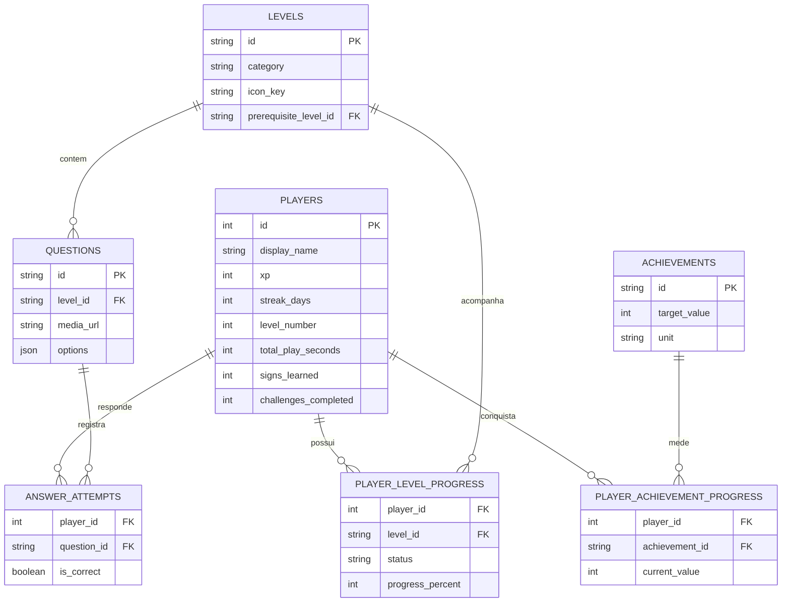

# LBRLibras

Protótipo full stack gamificado para o ensino introdutório de Libras, desenvolvido como Trabalho de Conclusão do Curso de Sistemas para Internet do IFRO.

## Arquitetura

- `backend/`: API Python com FastAPI, SQLAlchemy e SQLite, responsável pelo catálogo, respostas e progresso persistente.
- `frontend/`: aplicação React, TypeScript, Vite, Tailwind CSS e Framer Motion, com interface mobile-first.

## Executar o backend

```bash
cd backend
python -m venv .venv
.venv/Scripts/activate
python -m pip install -e ".[dev]"
uvicorn app.main:app --reload
```

A API ficará disponível em `http://localhost:8000`. A documentação interativa estará em `http://localhost:8000/docs`.

## Executar o frontend

```bash
cd frontend
pnpm install
pnpm dev
```

O frontend ficará disponível em `http://localhost:5173`.

## Blocos do protótipo

1. ✅ Fundação full stack e design system.
2. ✅ Menu principal, XP e desbloqueio local.
3. ✅ Área de jogo, feedback imediato, conclusão idempotente e +250 XP.
4. ✅ SQLite, histórico de respostas e servidor de mídias reais.
5. ✅ Menu autoral por categorias, perfil, estatísticas e conquistas persistentes.

## Progresso do protótipo

O menu consulta `GET /api/game/levels`, agrupa os tópicos em Princípios básicos, Alfabeto e Números e aplica os pré-requisitos informados pela API. O perfil e suas conquistas são carregados por `GET /api/game/profile`. O Nível 1 carrega as questões por `GET /api/game/levels/{level_id}/questions`, valida cada escolha por `POST /api/game/levels/{level_id}/questions/{question_id}/answer` e registra a conclusão por `POST /api/game/levels/{level_id}/complete`.

O SQLite é a fonte principal de progresso e o `LocalStorage` funciona como cópia local de apoio. A conclusão é idempotente: repetir uma aula não concede XP duplicado. O histórico pode ser consultado em `GET /api/game/progress/answers`.

## Esquema SQLite

| Tabela | Responsabilidade |
| --- | --- |
| `players` | Perfil, XP, sequência, tempo jogado e estatísticas de aprendizagem. |
| `levels` | Catálogo, categoria, ícone, ordem, recompensa e pré-requisito dos tópicos. |
| `questions` | Pergunta, opções, gabarito e caminho da mídia. |
| `player_level_progress` | Estado bloqueado, disponível ou concluído por usuário. |
| `answer_attempts` | Alternativa escolhida, acerto/erro e data de cada resposta. |
| `achievements` | Catálogo das conquistas, metas, unidades e identidade visual. |
| `player_achievement_progress` | Valor atual e desbloqueio de cada conquista por usuário. |

### Diagrama entidade-relacionamento



O arquivo local é criado automaticamente em `backend/data/lbrlibras.db`. Reiniciar a API não apaga XP, desbloqueios ou respostas.

## Mídia de Libras

O componente aceita MP4, GIF, WebP e outras imagens. O FastAPI publica `backend/static/media/` em `/static/media/`. Os nomes esperados para o Nível 1 estão descritos em `backend/static/media/signs/README.md`.

Enquanto os sinais reais não forem gravados e validados por um profissional de Libras, o jogo exibe um estado visual de demonstração claramente identificado, evitando apresentar gestos inventados como conteúdo pedagógico.

### VLibras e Hand Talk

O VLibras oferece widget e serviços públicos de tradução automática. Entretanto, o próprio [VLibras Vídeo](https://video.vlibras.gov.br/) informa que traduções automáticas não são autorizadas para cursos e aulas e recomenda intérpretes humanos nesses contextos. Por isso, o avatar não é usado como gabarito pedagógico deste protótipo sem revisão humana.

A [Hand Talk](https://docs.handtalk.me/docs/introducao/) disponibiliza seu tradutor de sites por plugin e token. Sua Customer API pública documentada fornece métricas de uso do plugin, não geração de mídias. Essa integração é tratada como recurso de acessibilidade separado, não como banco aberto de vídeos das questões.

## Autoria e direitos

Copyright © 2026 **JVitorDkx**. Todos os direitos reservados.

Este repositório contém um Trabalho de Conclusão de Curso do IFRO. A disponibilização pública para avaliação, demonstração e portfólio não concede permissão para copiar, redistribuir, sublicenciar ou apresentar o projeto, total ou parcialmente, como trabalho próprio. Consulte [COPYRIGHT.md](COPYRIGHT.md).

Bibliotecas, serviços e conteúdos de terceiros permanecem sujeitos às licenças e aos termos de seus respectivos titulares.
