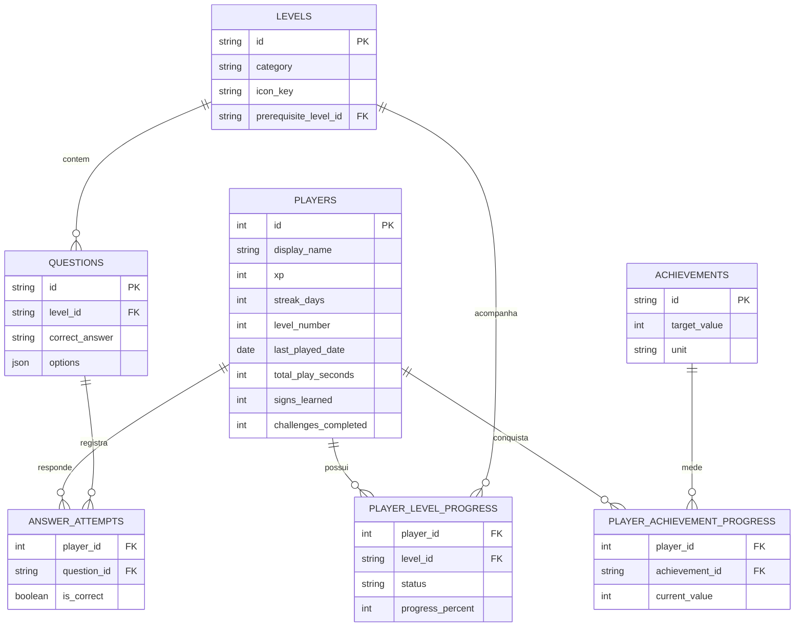

# LBRLibras

Protótipo full stack gamificado para o ensino introdutório de Libras, desenvolvido como Trabalho de Conclusão do Curso de Sistemas para Internet do IFRO.

## Arquitetura

- `backend/`: API Python com FastAPI, SQLAlchemy e SQLite, responsável pelo catálogo, respostas e progresso persistente.
- `frontend/`: aplicação React, TypeScript, Vite, Tailwind CSS e Framer Motion, com interface mobile-first.

## Executar o backend

```bash
cd backend
python -m venv .venv
.venv/Scripts/activate
python -m pip install -e ".[dev]"
uvicorn app.main:app --reload --port 8001
```

A API ficará disponível em `http://127.0.0.1:8001`. A documentação interativa estará em `http://127.0.0.1:8001/docs`.

## Executar o frontend

```bash
cd frontend
pnpm install
pnpm dev
```

O frontend ficará disponível em `http://localhost:5173`.

## Blocos do protótipo

1. ✅ Fundação full stack e design system.
2. ✅ Menu principal, XP e desbloqueio por pré-requisitos.
3. ✅ Área de jogo, feedback imediato, conclusão idempotente e +250 XP.
4. ✅ SQLite, histórico de respostas e servidor de mídias reais.
5. ✅ Menu autoral por categorias, perfil, estatísticas e conquistas persistentes.
6. ✅ Gamificação avançada com combo, XP por acerto, níveis progressivos e ofensiva diária.

## Progresso do protótipo

O menu consulta `GET /api/game/levels`, agrupa os tópicos em Princípios básicos, Alfabeto e Números e aplica os pré-requisitos informados pela API. O perfil e suas conquistas são carregados por `GET /api/game/profile`. Os módulos jogáveis carregam as questões por `GET /api/game/levels/{level_id}/questions`, validam cada escolha por `POST /api/game/levels/{level_id}/questions/{question_id}/answer` e registram a conclusão por `POST /api/game/levels/{level_id}/complete`.

O recorte pedagógico atual possui 16 atividades: quatro de Cumprimentos, seis do Alfabeto A–F e seis de Números de zero a cinco. A estrutura, as frases enviadas ao avatar e o status de validação estão documentados na [matriz de conteúdo](docs/MATRIZ_CONTEUDO.md).

O SQLite é a única fonte de verdade do progresso. O frontend não calcula desbloqueios nem restaura XP pelo `LocalStorage`: ele apresenta os estados `locked`, `available` e `completed` devolvidos pela API. O armazenamento local permanece restrito às preferências de interface, como sons e ativação do VLibras.

O backend recusa com `403` o acesso a perguntas, respostas ou conclusão de módulos bloqueados. Uma conclusão só é aceita depois que todas as questões do nível possuem ao menos um acerto persistido; tentativas incompletas recebem `409` e não ganham a recompensa da aula. O XP por primeiro acerto e a recompensa de conclusão são idempotentes e recalculados pelo histórico, impedindo totais divergentes ou alterados somente no cliente.

Cada primeiro acerto em uma questão concede 25 XP. Os níveis usam limites cumulativos crescentes: o nível 2 começa em 100 XP, o nível 3 em 250 XP e os custos seguintes aumentam em 50 XP. A coluna `last_played_date` permite incrementar a ofensiva apenas uma vez por dia, manter a sequência em dias consecutivos e reiniciá-la após uma lacuna.

Durante cada aula, o frontend mantém o combo visual instantâneo para as animações. Para o perfil, o backend reconstrói o maior combo pela ordem cronológica das respostas salvas, reiniciando a sequência após erro, troca de módulo ou repetição de questão. XP, sinais aprendidos, aulas concluídas, ofensiva e conquistas também são derivados de `answer_attempts` e `player_level_progress` antes de serem devolvidos por `GET /api/game/profile`.

## Métricas de aprendizagem

O endpoint `GET /api/game/analytics` consolida o histórico em um relatório pedagógico por módulo. Para Cumprimentos, Alfabeto e Números, a API informa tentativas, acertos, taxa de acerto por tentativa, sinais distintos dominados, progresso do conteúdo e situação de acesso.

A classificação visual segue critérios reproduzíveis:

- **Excelente domínio:** conteúdo 100% concluído e pelo menos 80% de acerto.
- **Bom progresso:** pelo menos 60% de acerto.
- **Precisa praticar:** taxa de acerto abaixo de 60%.
- **Ainda não iniciado:** nenhuma tentativa registrada.

O sistema não apresenta tempo médio de resposta porque o modelo atual registra o horário da resposta, mas ainda não registra o instante em que a questão foi exibida. Em vez de estimar um valor impreciso, o relatório utiliza a taxa de acerto por tentativa, calculada exclusivamente a partir das evidências persistidas no SQLite.

## Esquema SQLite

| Tabela | Responsabilidade |
| --- | --- |
| `players` | Perfil, XP, sequência, tempo jogado e estatísticas de aprendizagem. |
| `levels` | Catálogo, categoria, ícone, ordem, recompensa e pré-requisito dos tópicos. |
| `questions` | Pergunta, opções, gabarito e frase enviada ao avatar. |
| `player_level_progress` | Estado bloqueado, disponível ou concluído por usuário. |
| `answer_attempts` | Alternativa escolhida, acerto/erro e data de cada resposta. |
| `achievements` | Catálogo das conquistas, metas, unidades e identidade visual. |
| `player_achievement_progress` | Valor atual e desbloqueio de cada conquista por usuário. |

### Diagrama entidade-relacionamento



O arquivo local é criado automaticamente em `backend/data/lbrlibras.db`. Reiniciar a API não apaga XP, desbloqueios ou respostas.

## Integração técnica com o VLibras

### Solução do conflito entre React e o script externo

O VLibras foi originalmente projetado para controlar diretamente elementos do DOM. Já o React mantém sua própria árvore virtual e pode montar, desmontar ou recriar componentes durante mudanças de tela e também durante as verificações do `StrictMode`. Criar a estrutura do widget dentro de um componente React fazia o script externo conservar referências para elementos que já haviam sido removidos, causando instâncias duplicadas, falhas de inicialização e perda do player.

Para evitar esse conflito, a raiz oficial do VLibras foi declarada uma única vez no `frontend/index.html`:

```html
<div vw class="enabled">
  <div vw-access-button class="active"></div>
  <div vw-plugin-wrapper>
    <div class="vw-plugin-top-wrapper"></div>
  </div>
</div>
```

Essa estrutura é estática e existe fora da raiz controlada pelo React. A aplicação inicializa somente uma instância global de `window.VLibras.Widget`. Quando uma pergunta é aberta, o React não recria o widget: o gerenciador `vlibrasGamePlayer.ts` reutiliza a referência do DOM real e reposiciona o mesmo elemento `[vw]` dentro do card `lbr-vlibras-stage`. Ao sair da partida, a estrutura retorna à sua raiz técnica oculta. Essa estratégia mantém a hierarquia interna esperada pelo player Unity e evita conflitos entre o ciclo de vida do React e o script oficial.

A reprodução também é sincronizada com o carregamento assíncrono do player. O código aguarda `window.plugin.player`, interrompe a apresentação inicial do avatar, espera o evento `stop:welcome` e então envia exclusivamente a resposta correta da questão para `player.translate(...)`. Nas perguntas seguintes, a animação anterior é interrompida antes da nova tradução.

O aquecimento do motor WebGL começa na raiz `App` assim que a aplicação é aberta. Durante o Menu, a instância única permanece estacionada em uma área técnica fora da tela, com dimensões reais de `480 × 360`, para que a Unity consiga preparar o canvas sem exibir o widget. Ao entrar na aula, o mesmo nó já carregado é movido para o card da pergunta, evitando uma nova inicialização e reduzindo a espera antes do primeiro sinal. A promessa de preparação é compartilhada entre o preload e a partida para impedir condições de corrida durante a animação de boas-vindas.

As `div`s de progresso injetadas diretamente em `#gameContainer` pelo `UnityLoader` — incluindo logos e barras padrão — são ocultadas sem afetar o `canvas` irmão que renderiza o avatar. O palco começa com opacidade zero e recebe a classe `is-ready` somente depois que o player está utilizável e a tradução foi enviada; uma transição curta de opacidade revela então apenas o personagem pronto.

### Usabilidade e enquadramento do avatar

A interface flutuante padrão do widget não faz parte da navegação do jogo. Os elementos `[vw-access-button]`, `.vp-access-button`, `.vp-pop-up` e `.vw-links` são ocultados globalmente com `display: none !important`. A captura de interação do widget também permanece desativada, evitando o botão intermediário “Interagir” e permitindo que o estudante utilize somente as alternativas criadas pela aplicação.

Uma versão mínima dessa regra de ocultação também fica embutida no `<head>` do `index.html`. Por ser aplicada antes do download dos estilos do React e antes da inicialização do script externo, ela evita o flash do botão azul de acessibilidade durante a primeira pintura da página.

Dentro da fase, apenas o player é exibido. O contêiner usa proporção `4 / 3`, centralização vertical e margens de segurança de `16px` nas laterais. O canvas respeita `object-fit: contain`, não utiliza ampliações negativas e fica limitado pelas bordas arredondadas do card. Esse enquadramento preserva espaço para a cabeça, os braços e as mãos em sinais com movimentos amplos, sem deformar ou deixar o avatar vazar sobre o restante da interface.

O FastAPI fornece `avatar_phrase` diretamente a partir de `Question.correct_answer` armazenado no SQLite. Assim, o avatar representa sempre o gabarito da pergunta atual, enquanto as alternativas permanecem sob responsabilidade da interface React.

> **Nota pedagógica:** traduções automáticas devem ser revisadas por uma pessoa especialista em Libras antes do uso do protótipo como material educacional definitivo.

### Resiliência da dependência externa

O VLibras é carregado a partir de um serviço externo e, por isso, pode sofrer
indisponibilidade de rede sem relação com o LBRLibras. O preload global continua
silencioso para não bloquear o Menu. Se o motor não ficar pronto dentro do tempo
limite, o card da pergunta preserva o restante da aula e apresenta uma mensagem
amigável com o botão **Tentar novamente**.

Na nova tentativa, o gerenciador descarta somente promessas rejeitadas e uma tag
de script que falhou antes de registrar `window.VLibras`. Se a instância global
estiver saudável, ela é obrigatoriamente reaproveitada. Essa distinção permite
recuperar uma oscilação do serviço sem criar dois widgets ou corromper o canvas
Unity. O player também permanece sem fallback de sinais artificiais: a ausência
do avatar é informada com transparência ao estudante.

## Tratamento global de falhas

A árvore React é protegida por um `AppErrorBoundary`. Uma exceção inesperada de
renderização deixa de produzir uma tela vazia e passa a exibir uma interface
consistente, informando que o progresso salvo no backend continua protegido e
oferecendo a recarga do aplicativo. Falhas esperadas de rede continuam tratadas
localmente pelas telas, porque um Error Boundary não substitui o tratamento de
requisições assíncronas.

## Configuração por ambiente

Nenhum endereço de produção precisa ser gravado no código-fonte.

| Camada | Variável | Exemplo | Finalidade |
| --- | --- | --- | --- |
| Frontend | `VITE_API_URL` | `https://lbrlibras-api.onrender.com/api` | URL pública completa da API. |
| Backend | `LBRLIBRAS_CORS_ORIGINS` | `["https://lbr-libras-app.vercel.app"]` | Lista JSON de origens autorizadas. |
| Backend | `LBRLIBRAS_DATABASE_URL` | `sqlite:////var/data/lbrlibras.db` | Banco em volume persistente. |

Os arquivos `frontend/.env.example` e `backend/.env.example` documentam os
valores locais. Arquivos `.env` reais permanecem ignorados pelo Git. A URL do
frontend deve incluir o prefixo `/api` e não precisa terminar com barra.

## Build de produção

Antes de publicar, execute as mesmas verificações usadas no desenvolvimento:

```bash
cd backend
python -m pytest -q
python -m ruff check .

cd ../frontend
pnpm test
pnpm run typecheck
pnpm run build
```

O build estático do frontend será criado em `frontend/dist`.

## Publicação na nuvem

### 1. Backend FastAPI no Render

O arquivo `render.yaml` da raiz descreve o serviço, o comando do Uvicorn, o
health check e um disco de 1 GB para o SQLite.

1. No Render, crie um **Blueprint** conectado a este repositório e selecione o
   `render.yaml`.
2. Informe `LBRLIBRAS_CORS_ORIGINS` como uma lista JSON contendo o domínio real
   do frontend, por exemplo `["https://lbr-libras-app.vercel.app"]`.
3. Mantenha o disco montado em `/var/data`. Sem volume persistente, o SQLite pode
   ser recriado a cada novo deploy e não é adequado para a demonstração.
4. Depois do deploy, confirme `https://SEU-BACKEND.onrender.com/api/health` e a
   documentação em `/docs`.

O backend respeita a porta fornecida pelo provedor por meio de `$PORT`. Caso o
plano escolhido não permita disco persistente, use um serviço que forneça volume
ou migre `LBRLIBRAS_DATABASE_URL` para um banco gerenciado antes da banca.

### 2. Frontend React no Vercel

1. Importe o mesmo repositório no Vercel e defina **Root Directory** como
   `frontend`.
2. Selecione o framework **Vite**, use `pnpm run build` e mantenha `dist` como
   diretório de saída.
3. Cadastre `VITE_API_URL` com a URL pública do Render acrescida de `/api`.
4. Publique e, em seguida, atualize `LBRLIBRAS_CORS_ORIGINS` no Render com o
   domínio definitivo fornecido pelo Vercel.
5. Gere um novo deploy do backend e valide Menu, Perfil, uma aula completa,
   desbloqueio, relatório pedagógico e nova tentativa do VLibras.

### Checklist para a banca

- API `/api/health` respondendo e documentação `/docs` acessível.
- Volume SQLite persistente ativo e progresso sobrevivendo a um redeploy.
- CORS limitado ao domínio publicado, sem curinga em produção.
- `VITE_API_URL` apontando para HTTPS e contendo `/api`.
- Navegação testada em viewport de celular e em uma segunda rede/dispositivo.
- Plano de demonstração ensaiado com o estado amigável de indisponibilidade do
  VLibras, caso o serviço do governo oscile.

## Autoria e direitos

Copyright © 2026 **JVitorDkx**. Todos os direitos reservados.

Este repositório contém um Trabalho de Conclusão de Curso do IFRO. A disponibilização pública para avaliação, demonstração e portfólio não concede permissão para copiar, redistribuir, sublicenciar ou apresentar o projeto, total ou parcialmente, como trabalho próprio. Consulte [COPYRIGHT.md](COPYRIGHT.md).

Bibliotecas, serviços e conteúdos de terceiros permanecem sujeitos às licenças e aos termos de seus respectivos titulares.
